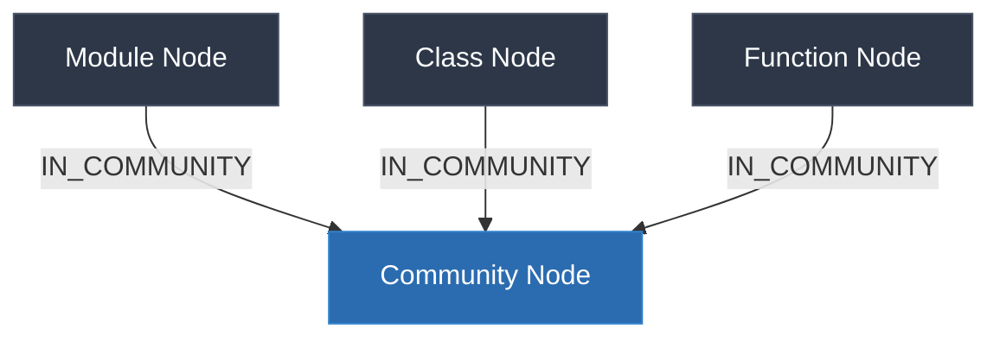

# ADR 003: Global GraphRAG via Hierarchical Community Summaries (Microsoft Option A)

## Context

The current Hybrid-RAG implementation is highly optimized for **Local RAG** tasks (answering questions about specific files, functions, classes, and their immediate relationships). It does this by combining Tree-Sitter AST parsing, vector search over raw code chunks, and FalkorDB Graph path traversal.

However, local retrieval methods fail completely on **Global RAG** queries (e.g., "Summarize the architecture of this codebase", "What are the main modules and their responsibilities?", or "Explain the dependency flow across the system"). 
*   **The Vector Search Bottleneck:** Vector similarity retrieval acts as a keyword-matching fallback on high-level conceptual questions, retrieving unrelated raw code snippets instead of structured architectural overviews.
*   **The Graph Bottleneck:** Standard local graph retrievers traverse 1-to-3-hop relationships around specific extracted entities. For repository-wide questions, there is no single starting entity, causing traversal to fail.

To solve this, we adapt **Microsoft's GraphRAG (Option A: Global Search)** architecture to an offline, privacy-preserving, local-first stack running on top of **FalkorDB**, **networkx**, and **Ollama (Gemma 2 9B)**.

---

## Decision

We will implement a **Global GraphRAG engine** utilizing **Community Detection** and **Hierarchical Summarization**. The design consists of three core components:

1.  **Graph Community Detection (Offline Compilation):**
    *   Retrieve the entire codebase graph (nodes and relationships) from FalkorDB.
    *   Construct an undirected projection graph using `networkx`.
    *   Execute Louvain community clustering (`networkx.algorithms.community.louvain_communities`) to partition the codebase into cohesive clusters (communities).
2.  **Community Summarization (Offline Compilation):**
    *   For each detected community, aggregate all member entities, their metadata, structural relationships, and context.
    *   Pass the community details to the local LLM (`gemma4:12b`) with a specialized structural summary prompt.
    *   Save the generated summaries as rich `Community` nodes in FalkorDB, establishing `[:IN_COMMUNITY]` relationships from code entities to their respective community.
3.  **Global Retrieval Engine (Online Query):**
    *   Upgrade the `QueryAnalyzer` to detect global architectural queries (e.g., query type `"global"`).
    *   Retrieve all active `Community` nodes and their structural summaries from FalkorDB.
    *   Generate a synthesized global report by feeding the aggregate summaries into the local LLM within its context window.

---

## Architectural Schema

### Graph Database Schema Extensions
We introduce a new node label `Community` and an edge type `IN_COMMUNITY`:



Properties of `Community`:
*   `id`: `community_lvl_<level>_<index>`
*   `name`: A descriptive name generated by the LLM (e.g., "Database Connections and Operations")
*   `level`: Clustering hierarchy depth (default: `0` for leaf communities)
*   `summary`: A rich Markdown architectural summary of the community (responsibilities, key files, usage patterns).

---

## Detailed Workflow

### 1. Community Compilation Pipeline (`hybrid-rag community build`)
An offline builder runs via the CLI:
1.  **Graph Extraction:** Runs Cypher `MATCH (n) OPTIONAL MATCH (n)-[r]->(m) RETURN n, r, m`.
2.  **NetworkX Projection:** Constructs an undirected graph $G = (V, E)$ where nodes represent modules, classes, and functions, and edge weights represent relationship density.
3.  **Louvain Partitioning:** Applies modularity clustering. Louvain naturally balances community sizes based on edge density (e.g., class inheritance, imports, and function calls stay clustered).
4.  **LLM Summarization:** For each cluster, we extract:
    *   Member entity names and file paths.
    *   Internal relationships (e.g., `A inherits B`).
    *   External dependencies (edges pointing outside the cluster).
    *   Prompt is sent to Ollama:
        ```text
        [System: You are an principal software architect.]
        Summarize the following code community. Explain its primary purpose, list the main classes/functions, and describe how other parts of the system interact with it.
        ```
5.  **FalkorDB Writeback:**
    *   Clears previous `Community` nodes.
    *   Writes new `Community` nodes.
    *   Links each member to its `Community` via `IN_COMMUNITY` edges.

### 2. Retrieval & Synthesis
*   **Query Detection:** A global query is triggered when the question matches global semantic signals (e.g., "summarize", "architecture", "structure", "overview", "codebase design").
*   **Context Retrieval:** Replaces chunk vector retrieval with Community retrieval:
    ```cypher
    MATCH (c:Community) RETURN c.name, c.summary
    ```
*   **Synthesis (Map-Reduce / Direct Packing):**
    *   Since Gemma 2 9B supports a 128k context window, we can directly pack all community summaries (typically 3–8 communities, ~500 words each = ~4000 tokens) into the context window.
    *   The LLM generates a comprehensive, cohesive, and perfectly accurate repository summary.

---

## Consequences

### Pros
*   **Architectural Awareness:** The RAG system can explain structural design, design patterns, and cross-module workflows perfectly.
*   **Local Execution:** No API costs or data leakage; all community summarization is performed completely offline on the M4 Mac.
*   **FalkorDB Native:** Graph communities are stored directly in the database, allowing D3.js frontend visualization of the codebase partitioned by communities!

### Cons
*   **One-time CPU Overhead:** The community build process is computationally heavy because it calls the LLM once per community. However, this is done once after indexing and can be cached.
