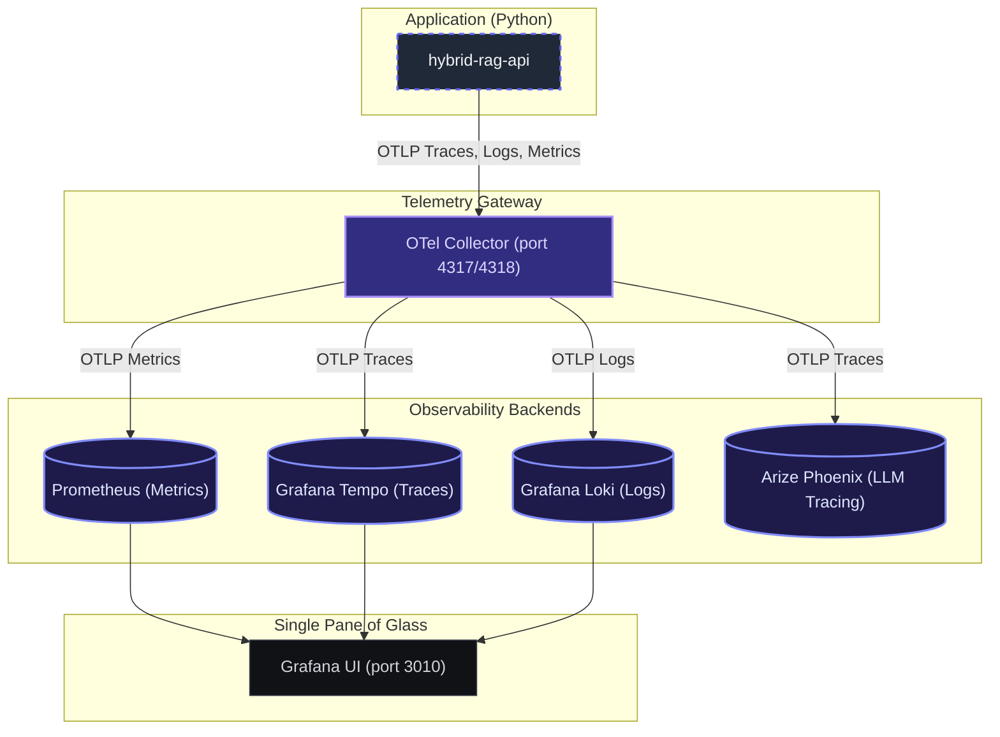

# ADR 005: Unified OpenTelemetry Observability Stack

## Status
Accepted

## Context
As the `hybrid-RAG` system matured, our observability stack became fragmented:
* Metrics were scraped by Prometheus and visualized in Grafana.
* Traces were sent directly to Arize Phoenix.
* Logs were dumped directly to stdout/stderr and only accessible via raw docker logging.

This division lacked a single interface for system analysis (correlation of logs, traces, and metrics) and resulted in a non-standard telemetry architecture that made it difficult to inspect system health alongside LLM span evaluations.

## Decision
We standardized our telemetry pipeline around OpenTelemetry (OTel) standards by implementing a centralized OpenTelemetry Collector:

1. **OTel Collector Gateway:** Set up a single `otel-collector` container acting as the ingestion hub for all signals (traces, logs, metrics).
2. **Unified Grafana Stack (Loki + Tempo):** Added **Grafana Loki** (for log storage) and **Grafana Tempo** (for trace storage) to Grafana, allowing all system telemetry signals to be viewed together.
3. **LLM Specialized Tracing Routing:** Configure the OTel Collector to split OTLP traces: routing LLM-specific spans to **Arize Phoenix** (for prompt evaluation) and system spans to **Grafana Tempo**.
4. **Log-to-Trace Correlation:** Python logging formatters are updated to inject `trace_id` and `span_id` automatically. OTel logging exporter streams Python logs directly to Loki via OTLP, enabling instant trace jumping from any log line in Grafana.

### Observability Architecture Design

## Consequences
* **Single Pane of Glass:** Developers can monitor system metrics, read logs, and trace queries within Grafana at port `3010`.
* **Trace-to-Log Correlation:** Correlated trace IDs in logs reduce troubleshooting latency.
* **Separation of Concerns:** System APM is handled inside Grafana, while specialized prompt evaluation is cleanly handled inside Arize Phoenix at port `6006`.
* **Standardized Configuration:** Zero custom log scraping agents required; uses standard OTel gRPC/HTTP receivers.
