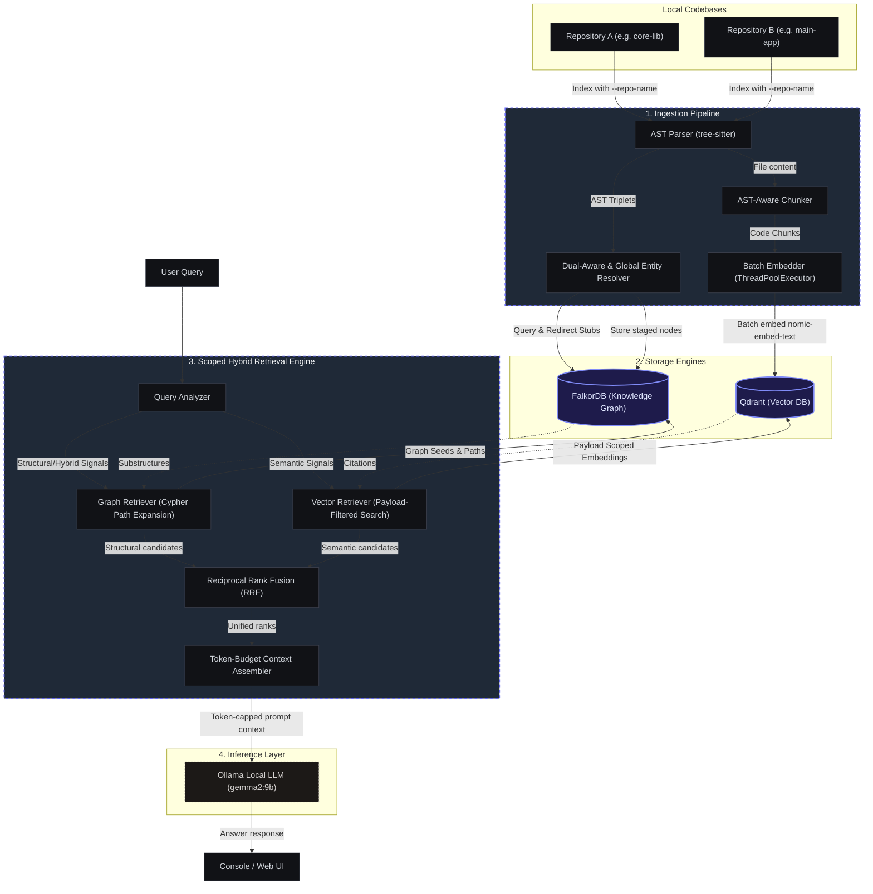
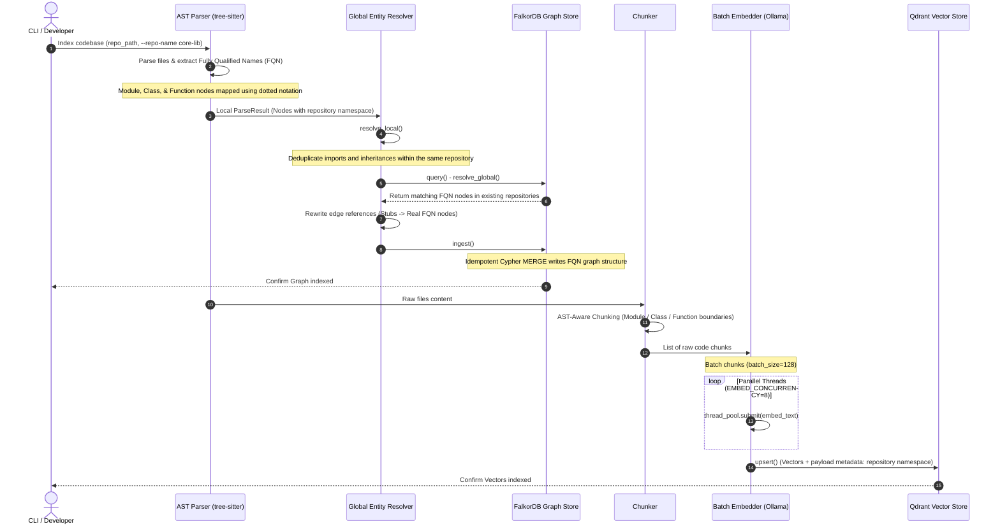

# System Architecture & Data Flow

Version: 1.0 (Production-Grade)

The Hybrid-RAG system is designed with a modular, **Ports and Adapters** (Hexagonal) architecture to support local, privacy-preserving, hybrid codebase analysis. By combining Abstract Syntax Tree (AST) structural insights with high-dimensional vector representations, the system solves the limitations of vector-only code search.

---

## High-Level Architecture Overview

All computations, embedding operations, and database storages remain strictly within the **local environment**. No data ever leaves the user's local boundary.



---

## 🛠️ Ingestion Pipeline (Flow & Architecture)

The ingestion pipeline converts raw source files (Python and Java) into a partitioned, resolved structural graph and high-dimensional vectors.



### Key Engineering Features in Ingestion
1.  **Fully Qualified Names (FQN):** Node IDs are represented using dotted-notation (`package.module.Class.method`) derived dynamically relative to the repository root. This guarantees 100% namespace isolation and eliminates graph node collisions between different modules.
2.  **Global Entity Resolution (Cross-Repo Linking):** External imports and inherits stubs are globally resolved against FalkorDB. If a matching FQN is found in another repository, the local stub node is deleted and the relationship edges (`[:INHERITS]`, `[:CALLS]`, `[:IMPORTS]`) are rewritten to link directly to the remote repository FQN node.
3.  **Parallel Embeddings:** Text chunks are processed in batch sizes of `128` and embedded concurrently via a `ThreadPoolExecutor` (default `concurrency=8`) talking to local Ollama, reducing indexing latency by up to **85%** compared to sequential calls.

---

## 🔍 Retrieval Flow (Flow & Architecture)

The retrieval engine fuses graph structures and vector semantics to extract the most relevant code chunks under a strict token budget.

```mermaid
graph LR
    %% Styling
    classDef default fill:#111216,stroke:#3b3f4c,stroke-width:1px,color:#d1d5db;
    classDef pipeline fill:#1f2937,stroke:#6366f1,stroke-width:1px,color:#f3f4f6;

    Query["User Query"] --> Analyzer["Query Analyzer"]
    
    subgraph ParallelPath ["Parallel Execution Path"]
        Analyzer --> |Structural query| GraphPath["Graph Path"]
        Analyzer --> |Semantic query| VectorPath["Vector Path"]
        
        GraphPath --> |Find FQN Seed Nodes| SeedSearch["FalkorDB Seed Matching"]
        SeedSearch --> |1 to 3 Hops Expansion| GraphTraversal["Graph Traversal (Cypher)"]
        
        VectorPath --> |Embed Query via Ollama| QueryEmbed["Ollama Query Embedding"]
        QueryEmbed --> |Payload-Filtered Search| VectorSearch["Qdrant Vector Search"]
    end
    
    GraphTraversal --> |Graph structural chunks| RRF["RRF Merger"]
    VectorSearch --> |Vector semantic chunks| RRF
    
    RRF --> |RRF Ranked Candidates| BudgetAssembler["Token-Budget Context Assembler"]
    BudgetAssembler --> |Filter out over-budget chunks| PackedContext["Context Packed Prompt"]
    PackedContext --> LLM["Local LLM (gemma2:9b)"]

    class ParallelPath pipeline;
```



### Key Engineering Features in Retrieval
1.  **Repository Scoping:** Searches can be locked down to a single repository by providing a `--repo-name` payload filter to Qdrant and restricting FalkorDB seed node lookups.
2.  **Token-Budget Context Assembly:** Prompts are packed dynamically using an AST-aware context builder. Results are popped from the RRF ranked queue and added to the prompt until a configured token threshold (`--max-tokens` or `--max-chars`) is hit. This prevents context window overflow and saves LLM attention.
3.  **Reciprocal Rank Fusion (RRF):** Merges semantic vector listings with multi-hop structural graphs using a parameterized scoring formula:
    $$score(d) = \sum_\{r \in R\} \frac\{W_r\}\{k + rank_r(d)\}$$
    *   `k = 60` (optimal baseline)
    *   `W_graph = 3.0` for structural queries, `1.5` for hybrid queries.

---

## 🏛️ Global GraphRAG & Community Detection

To solve repository-wide architectural queries (Global Search), the system implements Microsoft's GraphRAG Option A:
1. **Community detection:** Louvain clustering (`networkx`) partitions the codebase into functional modules.
2. **Community summaries:** Ollama compiles structural summaries describing the responsibilities and boundaries of each partition.
3. **Synthesis:** When a `"global"` query is detected, all community summaries are retrieved from FalkorDB and synthesized in a single LLM pass.

---

## 💾 Data Contracts & Models

### Ingestion → FalkorDB Graph Store
Graph schema models use structured nodes, community nodes, and typed edges containing repository namespaces.

```python
# Community Node Schema
{
    "id": "community_lvl_0_0",                         # Community index ID
    "label": "Community",                              # Node label
    "properties": {
        "name": "Authentication Layer",
        "summary": "This community manages login credentials and user sessions...",
        "level": 0
    }
}

# Code Node Schema

```python
# Node Schema
{
    "id": "llama_index.core.retrievers.BaseRetriever", # Fully Qualified Name
    "label": "Class",                                 # "Module" | "Class" | "Function"
    "properties": {
        "name": "BaseRetriever",
        "file_path": "llama_index/core/retrievers/base.py",
        "repository": "llama-core",                    # Repository namespace
        "type": "class"
    }
}

# Edge Schema
{
    "src_id": "llama_index.core.retrievers.AutoMergingRetriever",
    "rel": "INHERITS",                                 # "DEFINES" | "CALLS" | "IMPORTS" | "INHERITS"
    "dst_id": "llama_index.core.retrievers.BaseRetriever",
    "properties": {
        "repository": "llama-core"
    }
}
```

### Ingestion → Qdrant Vector Store
Vectors are partitioned using payload metadata to support fast, targeted scoping.

```python
{
    "id": "e3b0c442-98fc-1c14-9afb-f4c8996fb924",  # Deterministic UUID from FQN chunk ID
    "vector": [0.012, -0.045, ..., 0.312],          # 768-dimensional nomic-embed-text
    "payload": {
        "node_id": "llama_index.core.retrievers.AutoMergingRetriever::0",
        "label": "Class",
        "file_path": "llama_index/core/retrievers/auto_merging.py",
        "text": "class AutoMergingRetriever(BaseRetriever):\n    ...",
        "repository": "llama-core"                  # Namespace payload filter
    }
}
```

---

## 🔒 Privacy Boundary Enforcement

The codebase strictly enforces local data sovereignty:
*   **Offline Operation:** No external network requests are made. External API calls to non-localhost loops are explicitly prohibited.
*   **Docker Containerization:** Storage engines (FalkorDB, Qdrant) run on local loopback ports (`127.0.0.1`) only, preventing any external ingress or egress.
*   **Ollama Hosting:** Local embedding (`nomic-embed-text`) and inference (`gemma2:9b`) are hosted entirely offline.
