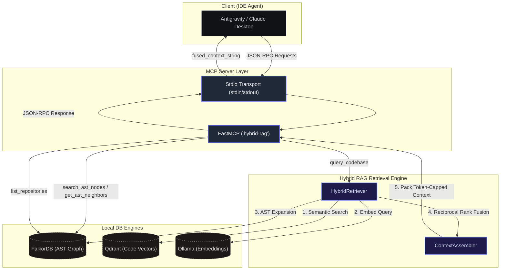

# Model Context Protocol (MCP) Server for Hybrid-RAG

The Hybrid-RAG project includes a local **Model Context Protocol (MCP) server**. This server exposes our multi-hop graph structure and Reciprocal Rank Fusion (RRF) vector-graph retrieval engine to MCP-compatible AI agents, IDEs, and assistants (e.g. Antigravity, Claude Desktop, Cline, Cursor, Windsurf).

---

## 🏛️ Architecture & Available Tools



The server is implemented via `FastMCP` and exposes the following tools:

1.  **`query_codebase(question, repository, top_k, max_tokens)`**
    *   **Description:** Performs RRF hybrid retrieval over FalkorDB and Qdrant under a strict token budget.
    *   **Returns:** Fused, ranked code chunks formatted for direct inclusion into an LLM context.
2.  **`list_repositories()`**
    *   **Description:** Returns a list of all repository namespaces indexed in the current database.
3.  **`search_ast_nodes(query, repository, limit)`**
    *   **Description:** Searches for FQN code entities (classes, methods, modules) using substring match.
4.  **`get_ast_neighbors(node_id, direction, limit)`**
    *   **Description:** Retrieves incoming or outgoing relations from the FalkorDB AST graph (e.g. tracing who calls a function, or what interface is inherited by a class).
5.  **`get_community_report(repository)`**
    *   **Description:** Returns Directory-based community partitioning summaries for high-level codebase architectural queries.

---

## 🚀 Installation & Running

First, ensure that the `mcp` optional dependencies are installed in your Python environment:

```bash
# Via Makefile (dev setup)
make install

# Or manually:
uv pip install -e ".[mcp]"
```

### 1. Running over stdio (Standard Input/Output)
This is the default mode used for local IDE agents and desktop apps:

```bash
hybrid-rag mcp --transport stdio
```

### 2. Running over SSE (Server-Sent Events)
Use this if you want to connect a web client or running client remotely:

```bash
hybrid-rag mcp --transport sse --host localhost --port 8001
```

#### Running via Docker Compose (SSE Mode)
You can launch the entire stack (FalkorDB, Qdrant, and the MCP SSE server) with a single command:

```bash
docker compose up -d --build
```
This builds the application image (including the `mcp` libraries) and maps the MCP SSE endpoint to `http://localhost:8001/sse`.

---

## 🔍 Verification & Testing

### 1. Verification via MCP CLI Inspector
You can test and verify all tools interactively using the official MCP CLI Inspector without configuring an IDE:

```bash
npx @modelcontextprotocol/inspector hybrid-rag mcp
```

This starts a local web server (usually at `http://localhost:5173`). Open it in your web browser to view registered tools, enter query arguments, and review the retrieval responses.

### 2. Run Automated Unit Tests
To run unit tests verifying the MCP server components and JSON-RPC registration:

```bash
pytest tests/unit/test_mcp_server.py
```

---

## 🔌 Client Configurations

### Claude Desktop
Add the following snippet to your Claude Desktop configuration file:
*   **macOS:** `~/Library/Application Support/Claude/claude_desktop_config.json`
*   **Windows:** `%APPDATA%\Claude\claude_desktop_config.json`

```json
{
  "mcpServers": {
    "hybrid-rag": {
      "command": "hybrid-rag",
      "args": ["mcp", "--transport", "stdio"],
      "env": {
        "FALKORDB_HOST": "localhost",
        "FALKORDB_PORT": "6379",
        "QDRANT_HOST": "localhost",
        "QDRANT_PORT": "6333"
      }
    }
  }
}
```

### Cline / VS Code
Add the server configuration under Cline's MCP settings:

```json
{
  "mcpServers": {
    "hybrid-rag": {
      "command": "hybrid-rag",
      "args": ["mcp", "--transport", "stdio"]
    }
  }
}
```

### Antigravity / Gemini Code Assist
Create or update the configuration file in your user profile:
*   **macOS / Linux:** `~/.gemini/settings.json`
*   **Windows:** `C:\Users\[YourUsername]\.gemini\settings.json`

Add the following configuration:

```json
{
  "mcpServers": {
    "hybrid-rag": {
      "command": "/Volumes/Kioxia_SSD/SSD_workspace/Personal/hybrid-RAG/.venv/bin/hybrid-rag",
      "args": ["mcp", "--transport", "stdio"],
      "env": {
        "FALKORDB_HOST": "localhost",
        "FALKORDB_PORT": "6379",
        "QDRANT_HOST": "localhost",
        "QDRANT_PORT": "6333",
        "OLLAMA_BASE_URL": "http://localhost:11434"
      }
    }
  }
}
```
*(Note: It is recommended to use the absolute path to the virtual environment binary as the `command` value so it executes with all library dependencies loaded).*

---

### 🐳 Alternative: Running the MCP Server inside Docker (Stdio Bridge)
If you prefer not to install the virtual environment on the host machine and want to run the MCP server strictly inside the Docker container, you can configure the client to communicate via a **docker stdio bridge**. 

To do this, specify `docker` as the command and use `exec -i` to forward stdio:

```json
{
  "mcpServers": {
    "hybrid-rag": {
      "command": "docker",
      "args": [
        "exec",
        "-i",
        "hybrid-rag-mcp",
        "hybrid-rag",
        "mcp",
        "--transport",
        "stdio"
      ]
    }
  }
}
```
*(Note: In this mode, environmental configurations like database hosts are read directly from the container's environment variables defined in your `docker-compose.yml` file, so no host-level `env` overrides are necessary).*

