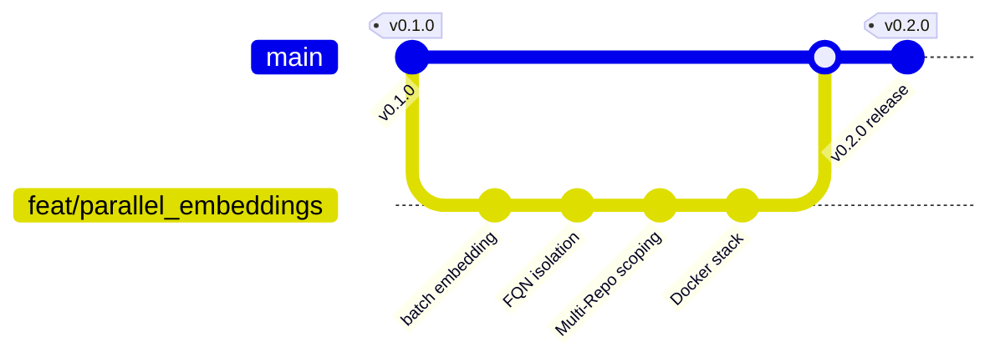

# Production Release Process Guide

This guide outlines the standard operating procedure (SOP) for versioning, packaging, automating, and deploying production releases of the Hybrid-RAG platform on private local machines or offline server environments.

---

## 📌 1. Versioning & Git Strategy (SemVer)

Hybrid-RAG adheres strictly to **Semantic Versioning (SemVer 2.0.0)**:
*   **MAJOR (`X.y.z`):** Incompatible API changes (e.g. swapping graph/vector ports).
*   **MINOR (`x.Y.z`):** Backward-compatible functional enhancements (e.g. FQN, Multi-Repo RAG, Token-Budget, Docker Stack).
*   **PATCH (`x.y.Z`):** Backward-compatible bug fixes (e.g. FQN resolver query fixes).

### Branching & Tagging Workflow
We follow the **GitHub Flow** with annotated git tags:



1.  **Develop & Merge:** Feature development happens on branch `feat/*` or `fix/*`, which is merged into `main` after passing unit & integration tests.
2.  **Tagging:** Create a release tag on `main`:
    ```bash
    git checkout main
    git pull origin main
    git tag -a v0.2.0 -m "Release v0.2.0 - Parallel Embeddings, FQN, Token-Budget, and Multi-Repo RAG"
    git push origin v0.2.0
    ```

---

## 📝 2. CHANGELOG & Release Preparation

Before pushing a release tag, you must update `CHANGELOG.md` following [Keep a Changelog](https://keepachangelog.com/en/1.0.0/):
1.  Change the `## [Unreleased]` header to the new version header (e.g., `## [0.2.0] - 2026-05-28`).
2.  Open a new `## [Unreleased]` block at the top for future development.
3.  Add all new features, enhancements, and performance metrics under `Added`, `Changed`, `Fixed`, or `Performance`.

---

## 🐳 3. Containerized Release Strategy (Private Machine)

For private servers, we distribute the application using pre-compiled Docker images stored in a **Private Container Registry** (such as GitHub Container Registry - GHCR, GitLab Registry, or a local Docker Registry like Harbor).

### Distribution Architecture

```
                                    ┌───────────────────────┐
                                    │    PRIVATE MACHINE    │
                                    │                       │
 ┌──────────────┐     Build/Push    │  ┌─────────────────┐  │
 │  CI/CD Runner│──────────────────►│  │ Docker Registry │  │
 └──────────────┘                   │  └────────┬────────┘  │
                                    │           │ Pull      │
                                    │           ▼           │
                                    │  ┌─────────────────┐  │
                                    │  │ Docker Compose  │  │
                                    │  └─────────────────┘  │
                                    └───────────────────────┘
```

1.  **Build Stage:** CI/CD builds the `Dockerfile` into a multi-platform image (e.g. `linux/amd64`, `linux/arm64`).
2.  **Registry Push:** The image is pushed as `ghcr.io/your-org/hybrid-rag-api:v0.2.0` (and tagged as `latest`).
3.  **Client Machine Pull:** The private server pulls this pre-built image using a simplified `docker-compose.prod.yml`, avoiding any compilation or local source code exposures.

---

## 🤖 4. CI/CD Release Automation (GitHub Actions Example)

Create a GitHub Actions workflow in `.github/workflows/release.yml` to fully automate testing, building, and publishing containerized releases:

```yaml
name: Production Release Pipeline

on:
  push:
    branches:
      - main
      - develop
    tags:
      - 'v*'
  pull_request:
    branches:
      - main
      - develop

jobs:
  test:
    name: Run Test Suite
    runs-on: ubuntu-latest
    steps:
      - uses: actions/checkout@v4
      - name: Set up uv
        uses: astral-sh/setup-uv@v5
        with:
          enable-cache: true
      - name: Set up Python
        uses: actions/setup-python@v5
        with:
          python-version: '3.12'
      - name: Install dependencies
        run: |
          uv pip install --system .[dev,api,mcp]
      - name: Run Pytest
        run: |
          pytest tests/ -v -m "not integration"

  build-and-publish:
    name: Build & Publish Docker Image
    needs: test
    # Only build and publish on push/merge/tag events, not on open pull requests
    if: github.event_name != 'pull_request'
    runs-on: ubuntu-latest
    permissions:
      contents: read
      packages: write
    steps:
      - uses: actions/checkout@v4
      
      - name: Set up QEMU (Multi-platform support)
        uses: docker/setup-qemu-action@v3
        
      - name: Set up Docker Buildx
        uses: docker/setup-buildx-action@v3
        
      - name: Login to GitHub Container Registry
        uses: docker/login-action@v3
        with:
          registry: ghcr.io
          username: ${{ github.actor }}
          password: ${{ secrets.GITHUB_TOKEN }}
          
      - name: Extract Docker metadata
        id: meta
        uses: docker/metadata-action@v5
        with:
          images: ghcr.io/${{ github.repository }}
          tags: |
            # 1. Generate SemVer tags on release tags (e.g. v0.2.0 -> 0.2.0)
            type=semver,pattern={{version}}
            # 2. Tag as 'latest' on pushes to stable main branch
            type=raw,value=latest,enable=${{ github.ref == 'refs/heads/main' }}
            # 3. Tag as 'develop' on pushes to develop branch (Industry-standard dev tag)
            type=raw,value=develop,enable=${{ github.ref == 'refs/heads/develop' }}
            # 4. Generate a unique short-sha tag for exact commit traceability
            type=sha,prefix=sha-
            
      - name: Build and Push Docker image
        uses: docker/build-push-action@v6
        with:
          context: .
          file: Dockerfile
          platforms: linux/amd64,linux/arm64
          push: true
          tags: ${{ steps.meta.outputs.tags }}
          labels: ${{ steps.meta.outputs.labels }}
          cache-from: type=gha
          cache-to: type=gha,mode=max
```

---

## 🚀 5. Deploying on Private Server

On the private machine, deployment requires only a `docker-compose.prod.yml` file and an `.env` config file:

### `docker-compose.prod.yml`
```yaml
services:
  falkordb:
    image: falkordb/falkordb:latest
    container_name: falkordb
    ports:
      - "6379:6379"
    volumes:
      - falkordb_data:/var/lib/falkordb/data
    restart: unless-stopped
    healthcheck:
      test: ["CMD", "redis-cli", "PING"]
      interval: 5s
      timeout: 3s
      retries: 5

  qdrant:
    image: qdrant/qdrant:latest
    container_name: qdrant
    ports:
      - "6333:6333"
    volumes:
      - qdrant_data:/qdrant/storage
    restart: unless-stopped
    healthcheck:
      test: ["CMD", "curl", "-f", "http://localhost:6333/healthz"]
      interval: 5s
      timeout: 3s
      retries: 5

  hybrid-rag-api:
    image: ghcr.io/your-org/hybrid-rag-api:latest  # Pull pre-built image
    container_name: hybrid-rag-api
    ports:
      - "8000:8000"
    environment:
      - FALKORDB_HOST=falkordb
      - QDRANT_HOST=qdrant
      - OLLAMA_BASE_URL=http://host.docker.internal:11434
    depends_on:
      falkordb:
        condition: service_healthy
      qdrant:
        condition: service_healthy
    extra_hosts:
      - "host.docker.internal:host-gateway"
    restart: unless-stopped

volumes:
  falkordb_data:
  qdrant_data:
```

### Launch Lệnh:
```bash
docker compose -f docker-compose.prod.yml up -d
```
No compilers, no Python environments. Pure, isolated production RAG runtime.
