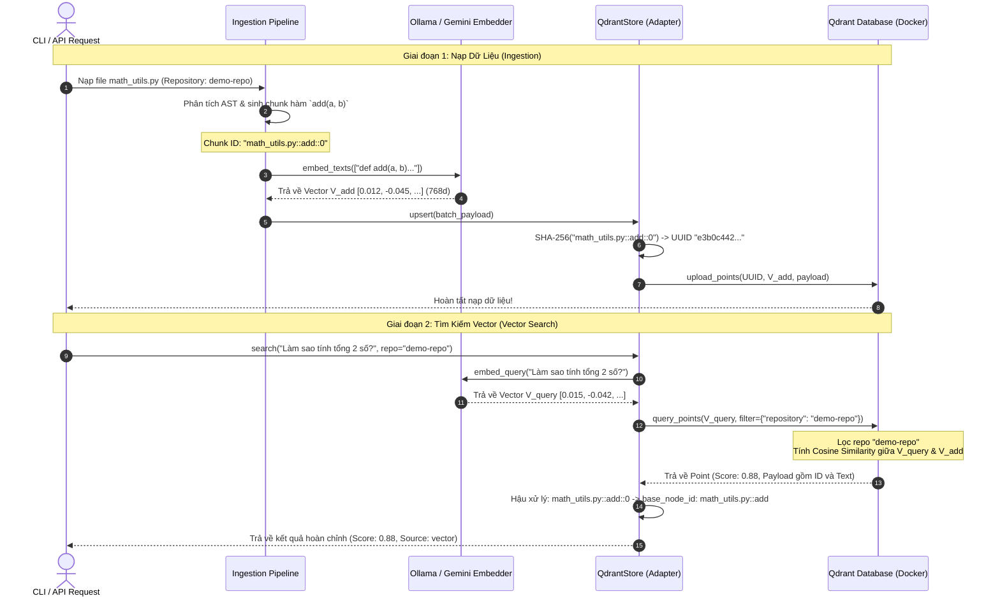

# Vector Search Flow & QdrantStore Deep Dive

Tài liệu này giải thích chi tiết cơ chế hoạt động của hệ thống Tìm kiếm Vector (Vector Search) trong Hybrid-RAG, đi sâu vào cấu trúc của bộ chuyển đổi [QdrantStore](file:///Volumes/Kioxia_SSD/SSD_workspace/Personal/hybrid-RAG/src/hybrid_rag/vector/qdrant_store.py) và cách dữ liệu code được xử lý từ lúc nạp (Ingestion) cho tới khi truy vấn (Retrieval).

---

## 1. Đi sâu cấu trúc QdrantStore

Lớp [QdrantStore](file:///Volumes/Kioxia_SSD/SSD_workspace/Personal/hybrid-RAG/src/hybrid_rag/vector/qdrant_store.py) là Adapter hiện thực hóa Port [VectorStore](file:///Volumes/Kioxia_SSD/SSD_workspace/Personal/hybrid-RAG/src/hybrid_rag/ports/vector_store.py), giao tiếp trực tiếp với Vector DB Qdrant. Các tính năng cốt lõi của nó bao gồm:

### A. Định danh Idempotent qua Stable UUIDs (`_deterministic_uuid`)
Qdrant yêu cầu Point ID phải ở định dạng UUID (chuỗi 36 ký tự) hoặc số nguyên không âm 64-bit (`uint64`). Tuy nhiên, trong AST của codebase, các định danh node thường là chuỗi ký tự dạng đường dẫn (ví dụ: `math_utils.py::add::0`).

Để giải quyết vấn đề này mà vẫn đảm bảo tính **idempotency** (ghi đè thay vì ghi trùng lặp khi chạy ingestion nhiều lần), hệ thống sử dụng thuật toán hash SHA-256 để chuyển đổi chuỗi định danh thành UUID ổn định:
```python
def _deterministic_uuid(node_id: str) -> str:
    """SHA-256 → stable UUID for idempotent upserts."""
    return str(uuid.UUID(bytes=hashlib.sha256(node_id.encode()).digest()[:16], version=4))
```
*   **Dòng chảy dữ liệu**: Node ID (`math_utils.py::add::0`) $\rightarrow$ SHA-256 Hash $\rightarrow$ Lấy 16 bytes đầu tiên $\rightarrow$ Khởi tạo `uuid.UUID` bản phát hành 4 $\rightarrow$ Trả về chuỗi UUID chuẩn.
*   **Lợi ích**: Dù chạy lại Pipeline Ingestion bao nhiêu lần trên cùng một file, UUID sinh ra cho chunk đó vẫn giống hệt nhau, giúp Qdrant tự động cập nhật (upsert) thay vì tạo bản ghi rác mới.

### B. Tổ chức Payload & Lọc Phạm Vi (Scoped Payload Filtering)
Mỗi Point lưu trong Qdrant bao gồm hai phần: **Vector embedding** và **Payload metadata**.
```python
payload = {
    "node_id": c["node_id"],       # ID gốc của chunk kèm chỉ số (ví dụ: my_func::0)
    "label": c["label"],           # Loại node (Class, Function, Module...)
    "file_path": c["file_path"],   # Đường dẫn tương đối của file nguồn
    "text": c["text"],             # Nội dung code block nguyên bản
    "repository": c["repository"]  # Tên repo dùng để lọc phạm vi truy vấn (Namespace)
}
```
Khi tìm kiếm, thay vì quét toàn bộ database, chúng ta lọc theo repository bằng `FieldCondition` của Qdrant:
```python
from qdrant_client.models import FieldCondition, Filter, MatchValue

if filter_payload:
    conditions = [
        FieldCondition(key=k, match=MatchValue(value=v)) 
        for k, v in filter_payload.items()
    ]
    query_filter = Filter(must=conditions)
```
Qdrant sẽ sử dụng chỉ mục (Payload Index) để lọc nhanh những bản ghi thuộc repo mong muốn trước khi tính toán độ tương đồng cosine, giúp giảm thiểu đáng kể số lượng phép tính khoảng cách vector cần thực hiện.

### C. Sử dụng API `query_points` mới
Kể từ phiên bản `qdrant-client >= 1.12`, phương thức `.search()` cũ đã bị loại bỏ dần. Hệ thống sử dụng API `query_points()` mới để tối ưu hiệu năng:
```python
results = self._client.query_points(
    collection_name=self._collection,
    query=embedding,       # Mảng float đại diện câu hỏi
    limit=top_k,           # Số lượng kết quả gần nhất cần lấy
    query_filter=query_filter,
    with_payload=True,     # Yêu cầu trả về thông tin Payload kèm theo
).points
```

### D. Tối ưu bộ nhớ khi nạp (Batching Upserts)
Để tránh quá tải RAM khi xử lý các repo lớn chứa hàng chục nghìn chunk, quá trình Ingestion được chia thành các batch có kích thước cố định là `128` chunk. 
Ngay sau khi gọi Embedder, danh sách các chunk tương ứng sẽ được gọi `vector_store.upsert(batch_payload)` để nạp trực tiếp vào Qdrant và các biến tạm sẽ được gán `None` cùng với việc kích hoạt Garbage Collector nhằm giải phóng bộ nhớ ngay lập tức.

---

## 2. Minh họa Case cụ thể & Luồng đi dữ liệu

Dưới đây là sơ đồ luồng dữ liệu minh họa từ lúc nạp một hàm tính toán đến khi truy vấn tìm kiếm hàm đó.



### Bước 1: Ingestion (Nạp hàm `add`)
1. Hàm nguồn trong `math_utils.py`:
   ```python
   def add(a, b):
       """Cộng 2 số."""
       return a + b
   ```
2. Phân tích ra chunk đại diện:
   * **Node ID**: `"math_utils.py::add::0"`
   * **Text**: `"def add(a, b):\n    \"\"\"Cộng 2 số.\"\"\"\n    return a + b"`
   * **Repository**: `"demo-repo"`
3. Lấy embedding (ví dụ dùng `nomic-embed-text` qua Ollama):
   * $$V_{\text{add}} = [0.012, -0.045, 0.089, \dots]$$
4. Nạp vào Qdrant:
   * UUID sinh ra: `_deterministic_uuid("math_utils.py::add::0")` $\rightarrow$ `"f5c92c01-f25b-5633-911a-85b4122dcd44"`.
   * Gửi request lên Qdrant lưu trữ thành công.

### Bước 2: Retrieval (Tìm kiếm ngữ nghĩa)
1. Người dùng hỏi: *"Làm sao tính tổng 2 số?"*
2. Chuyển câu hỏi thành Vector truy vấn:
   * $$V_{\text{query}} = [0.015, -0.042, 0.081, \dots]$$
3. Gửi lên Qdrant DB cùng với bộ lọc `"repository" == "demo-repo"`.
4. Cơ chế tính độ tương đồng của Qdrant:
   * Qdrant tính **Cosine Similarity** giữa vector truy vấn $V_{\text{query}}$ và tất cả các vector trong tập hợp đã được lọc:
     $$\text{Cosine Similarity}(V_{\text{query}}, V_{\text{add}}) = \frac{V_{\text{query}} \cdot V_{\text{add}}}{\|V_{\text{query}}\| \|V_{\text{add}}\|} \approx 0.88$$
   * Khoảng cách Cosine gần bằng `1.0` thể hiện mối quan hệ ngữ nghĩa rất gần nhau (tính tổng $\leftrightarrow$ cộng 2 số).
5. Trả về kết quả cho [VectorRetriever](file:///Volumes/Kioxia_SSD/SSD_workspace/Personal/hybrid-RAG/src/hybrid_rag/retrieval/vector_retriever.py):
   * `VectorRetriever` phát hiện hậu tố `::0` trong `node_id` `"math_utils.py::add::0"`.
   * Sử dụng hàm `_base_node_id` để chuẩn hóa nó thành `"math_utils.py::add"`, lưu vào trường `base_node_id`.
   * Đánh dấu nguồn gốc `"source": "vector"`.
6. Phản hồi cuối cùng:
   ```json
   {
     "node_id": "math_utils.py::add::0",
     "base_node_id": "math_utils.py::add",
     "label": "Function",
     "file_path": "math_utils.py",
     "text": "def add(a, b):\n    \"\"\"Cộng 2 số.\"\"\"\n    return a + b",
     "score": 0.88,
     "source": "vector"
   }
   ```
   Kết quả này sẽ được xếp hạng chéo với kết quả từ cấu trúc đồ thị (Graph RAG) thông qua thuật toán **Reciprocal Rank Fusion (RRF)** trước khi tạo prompt context cho LLM.
